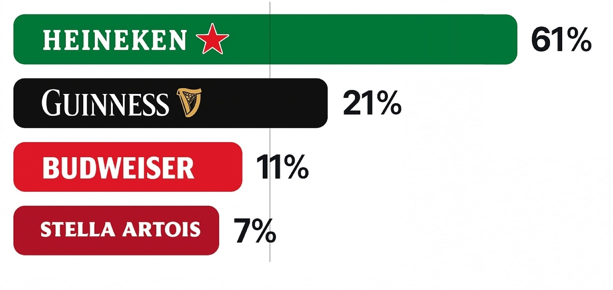
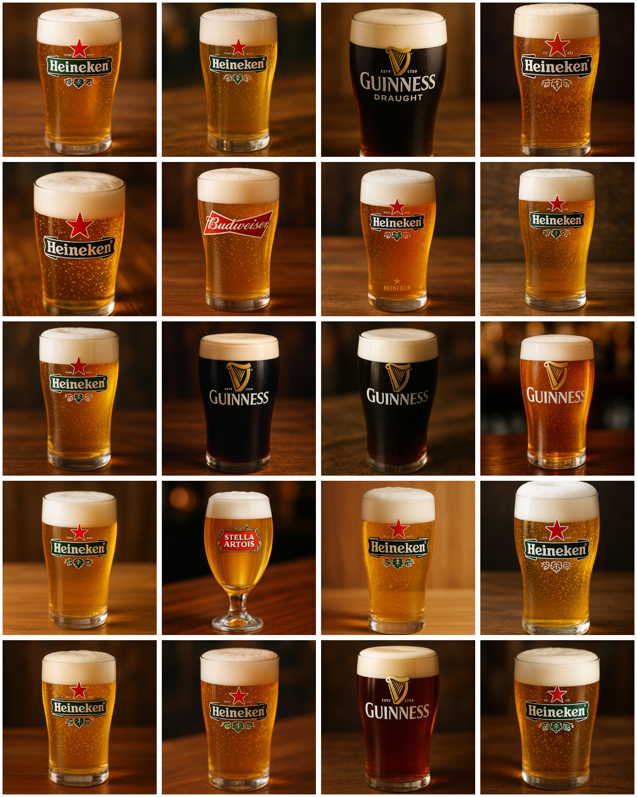

# The Best Beer in the World: An AI Perception Study

## The Experiment

We asked Azure's GPT-Image-1 model to generate "the best beer in the world" 100 times. Turns out, this AI has great taste.

The model showed a clear preference:

- **Heineken**: 61%
- **Guinness**: 21%
- **Budweiser**: 11%
- **Stella Artois**: 7%

### Outputs

## Method

- **Model**: Azure GPT-Image-1
- **API Version**: 2024-10-21
- **Number of requests**: 100
- **Prompt**: "A freshly poured glass of the best beer in the world. It is a well known brand."
- **Temperature/Seed**: Not configurable in current API

## What We Learned

Without sampling controls, GPT-Image-1 consistently returns its top associations for "best beer." The results reflect the model's training data - where certain brands appear more frequently in quality contexts.

Interesting to see how AI models develop preferences based on global data patterns. For applications requiring variety, this default behavior presents some limitations worth considering.
